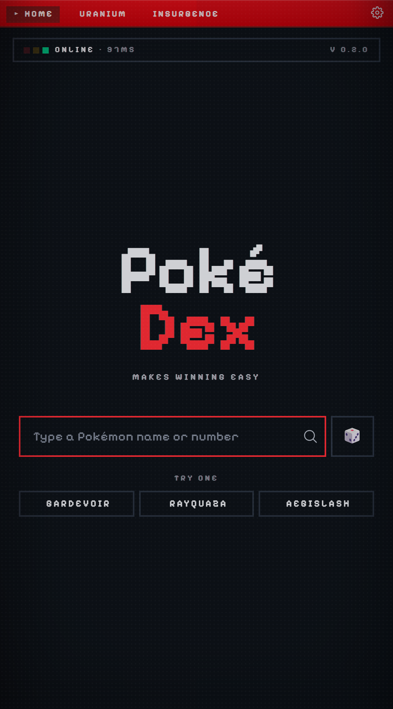
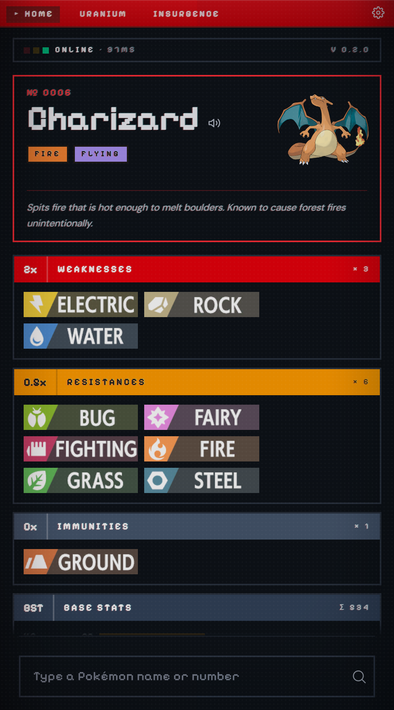
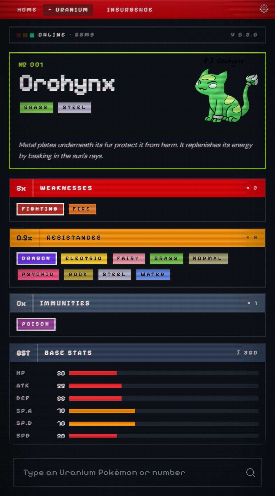
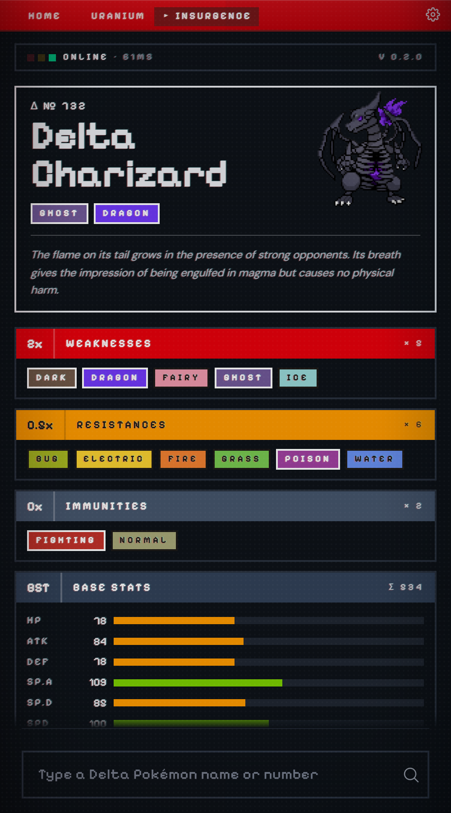
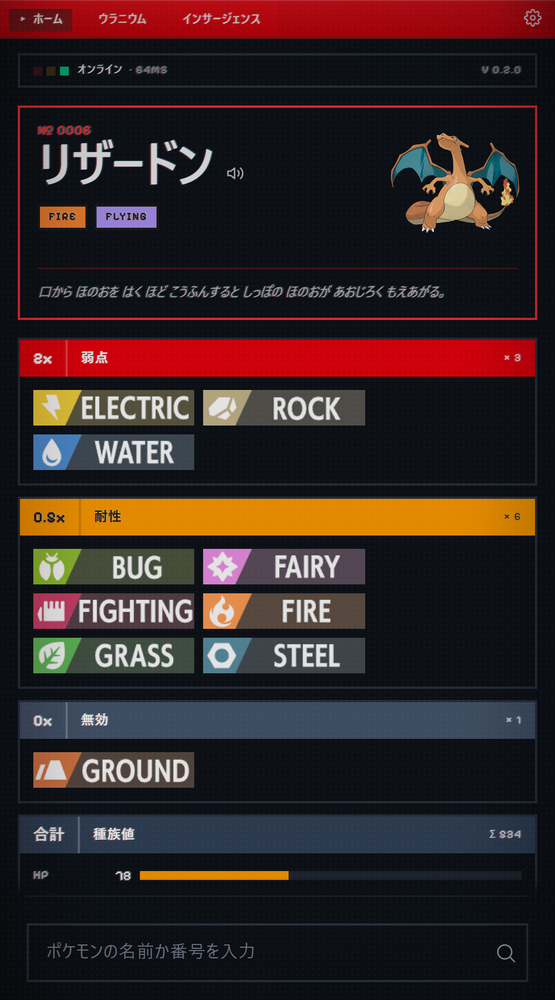
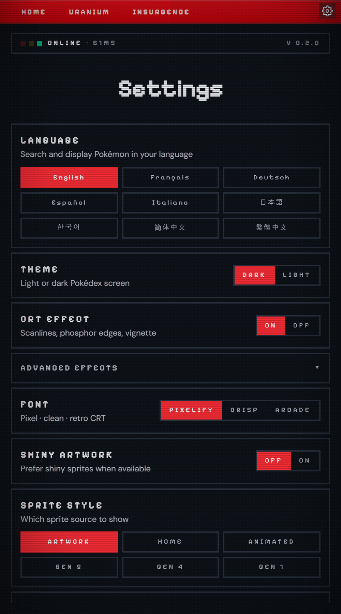

# PokéDex

> Ever found yourself in a fight against a Pokémon and wondering which attack would be the most effective? Check exactly that with this specialized version of the Pokedex!

Type a name or number, get the answer in one card: weaknesses, resistances, immunities, base stats, evolution chain, and the original Pokédex flavor text. Built for the seconds-matter moment mid-battle, but pretty enough to browse between matches.

  
  
  
  

## Features

### Type matchups across three games

- **Pokémon** - all 1025 species via PokéAPI, with proper dual-type effectiveness.
- **Pokémon Uranium** - 254 entries including 50 Mega / Nuclear variants with the Nuclear type baked into the chart.
- **Pokémon Insurgence** - 198 Delta Pokémon scraped from the Insurgence wiki, with the rebalanced Delta typings.

### Rich result view

Every result card carries: dex number, localized species name, type chips, cry playback button, base stats with color-graded bars, evolution chain (tap to scan an evolution), the original Pokédex flavor text, and the full weakness/resistance/immunity breakdown.

### 9 languages

English, French, German, Spanish, Italian, Japanese, Korean, Simplified Chinese, Traditional Chinese. UI strings + Pokémon species names both localize, so 「ピカチュウ」 displays as ピカチュウ on the Japanese setting. Auto-detects your OS locale on first launch - switch any time from Settings.

  
  

### Sprite + cry source picker

Choose how Pokémon are rendered: official artwork, Pokémon HOME 3D, Showdown animated, or pixel sprites from Gen 5 / Gen 4 / Gen 1. Cry playback picks between the latest game's recording or the legacy Gen-1-to-5 chiptune beep. Shiny mode shows shiny artwork when available across all sprite styles.

### Retro Pokédex aesthetic

Three font presets (Pixelify / Crisp / Arcade), light and dark themes (both honor `prefers-color-scheme` on first launch), and a CRT screen effect with per-effect toggles for scanlines, vignette, chromatic aberration, text-shadow flicker, and dot-matrix overlay. The brand stays red-on-dark by default; light mode inverts the "screen" without losing the red device shell.

### Persistent caching

The Rust backend persists every PokéAPI response - Pokémon, species, evolution chains, type effectiveness - to disk as JSON, keyed by a schema version. First search per Pokémon pays the network cost; repeat searches are instant and work offline. Clear from Settings → API cache.

## Install

### Windows

1. Grab the latest `*_setup.exe` or `*_en-US.msi` from the [Releases](https://github.com/infinitel8p/PokeDex/releases) page.
2. Run it. If Microsoft Defender SmartScreen objects, click **More info → Run anyway**.

### macOS

1. Grab the latest `.dmg` matching your architecture (Intel / Apple Silicon / Universal) from [Releases](https://github.com/infinitel8p/PokeDex/releases).
2. Open it and drag the app to **Applications**.
3. First launch: right-click the app icon, choose **Open**, then **Open** again in the dialog. It's saved as an exception going forward.

### Linux

`.deb` and `.AppImage` builds are published with each release.

### Android

No prebuilt Android binaries are published yet.

## Data sources

- **PokéAPI** - primary Pokémon data ([pokeapi.co](https://pokeapi.co))
- **PokeAPI/sprites** - type icons ([github.com/PokeAPI/sprites](https://github.com/PokeAPI/sprites))
- **PokéDex Sprites** - Uranium sprites self-hosted at [infinitel8p/PokeDexSprites](https://github.com/infinitel8p/PokeDexSprites)
- **Pokémon Uranium Wiki** - Uranium type data ([pokemonuranium.fandom.com](https://pokemonuranium.fandom.com))
- **The Pokemon Insurgence Wiki** - Delta Pokémon data and sprites ([wiki.p-insurgence.com](https://wiki.p-insurgence.com))

Pokémon, all related names, and game assets are © Nintendo / Game Freak / The Pokémon Company. Pokémon Uranium and Pokémon Insurgence are fan-made games; their data is used here under fair use for the type-matchup utility.
